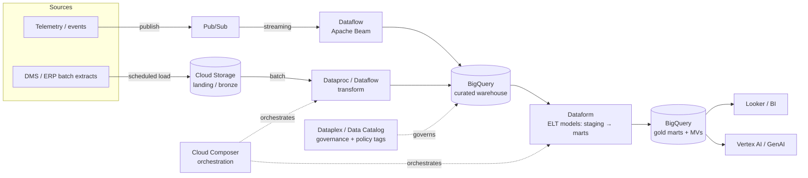

# GCP / BigQuery Reference Architecture — Cloud Data Platform

A reusable target-state reference architecture for modernizing a legacy on-prem
data platform onto Google Cloud, with **BigQuery** as the core analytics and
data-warehousing engine. This is the accelerator a Data Architect brings to a
client engagement; the [local proof](local_proof/) executes the BigQuery-dialect
model on DuckDB to validate the design, and the production artifacts
([BigQuery DDL](bigquery_ddl.sql), [Beam streaming](beam/streaming_pipeline.py),
[Terraform](terraform/main.tf), [Dataform](dataform/definitions.sqlx)) are the
deployment targets.

## Target architecture

## Layer-by-layer design & service choices

| Layer | GCP service | Why | Key tradeoff |
|---|---|---|---|
| Ingestion — batch | Cloud Storage + BigQuery load / `bq load` | Cheap durable landing; decouples source from warehouse | Latency (minutes–hours) vs streaming cost |
| Ingestion — streaming | Pub/Sub → Dataflow (Beam) → BigQuery Storage Write API | Exactly-once, autoscaling, low-latency | Higher cost; only where freshness is required |
| Batch transform | Dataflow or Dataproc (Spark) | Dataflow serverless for pipelines; Dataproc when reusing existing Spark | Dataproc = more control + ops; Dataflow = less ops |
| Warehouse | **BigQuery** | Serverless, separation of storage/compute, partition/cluster, MVs, BI Engine | Cost governed by bytes scanned & slots |
| ELT modeling | Dataform (or dbt) | SQL-first, version-controlled, dependency graph, assertions | Team upskilling on SQLX |
| Orchestration | Cloud Composer (Airflow) | Managed Airflow; DAGs, retries, SLAs | Cost of always-on environment |
| Governance | Dataplex / Data Catalog | Policy tags, column-level security, lineage, data profiles | Setup effort |
| Consumption | Looker / BigQuery BI Engine / Vertex AI | Governed metrics, sub-second BI, GenAI grounding | — |

## Migration approach (legacy → GCP)

1. **Assess & inventory** the legacy platform (sources, jobs, models, SLAs, PII).
2. **Land raw** in Cloud Storage / BigQuery bronze with schema-on-read; no logic yet.
3. **Re-model** in Dataform staging → conformed dimensions/facts (see [BigQuery DDL](bigquery_ddl.sql)); apply partitioning/clustering for cost.
4. **Reconcile** old vs new outputs (row counts, aggregates, field-level) before cutover — the dataset-comparison discipline.
5. **Cut over** consumption to BigQuery; decommission legacy in waves.
6. **Optimize** continuously: partition pruning, materialized views, slot reservations, cost dashboards.

## Non-functional design

- **Security:** IAM least-privilege, column-level security via policy tags, authorized/ authorized-dataset views for row/column governance, CMEK, VPC-SC perimeter. See [cost_governance.md](cost_governance.md).
- **Cost:** partitioning + clustering to minimize bytes scanned, materialized views for hot aggregates, BI Engine for dashboards, slot reservations vs on-demand, partition expiration for storage. Quantified in the [local proof](local_proof/).
- **Reliability:** Composer SLAs, Dataflow drain/update, BigQuery time-travel + snapshots for recovery.
